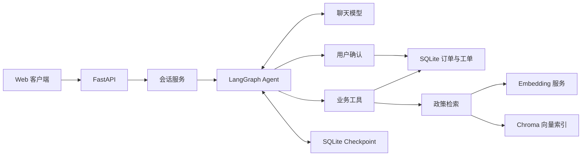

# SupportFlow

基于 FastAPI、LangGraph 和 Chroma 的售后服务 Agent，支持政策咨询、订单查询和质量问题换货申请。
通过工具调用连接业务数据与政策知识库，通过人工确认、业务校验和幂等写入控制工单创建。

## 功能

- **政策检索**：PDF 文本提取、分块、向量索引和来源引用。
- **订单查询**：按当前用户查询订单，隔离跨用户访问。
- **换货申请**：校验品类、签收状态和政策期限，提交前等待用户确认。
- **会话恢复**：保存对话与工具状态，支持审批恢复和失败重试。
- **执行记录**：展示工具路径、耗时、政策依据及模型 token 用量。
- **行为回归**：覆盖咨询、追问、权限、审批、取消与重复请求。

项目提供沙箱订单与政策数据。当前不对接真实商家、支付、退款、库存或物流系统。

## 架构



聊天模型选择工具并组织回答；后端执行身份校验、参数校验和工单写入。
知识库在独立建库阶段生成，在线查询只编码检索词并返回相关原文。

## 快速开始

要求 Python 3.11 或 3.12。使用虚拟环境，在项目根目录执行：

```bash
python -m pip install -r requirements.lock.txt
python -m pip install --no-deps -e .
```

复制 `.env.example` 为本地 `.env`，填写聊天服务密钥，并准备对应的 Embedding 服务。
聊天模型需要支持工具调用，Embedding 服务需要提供兼容的 `/embeddings` 接口。

```dotenv
AGENT_MODE=llm
LLM_API_KEY=<local-api-key>
LLM_BASE_URL=https://api.deepseek.com
LLM_MODEL=deepseek-flash
LLM_TEMPERATURE=0.7
LLM_MAX_TOKENS=1200
EMBEDDING_PROVIDER=api
EMBEDDING_API_KEY=ollama
EMBEDDING_BASE_URL=http://localhost:11434/v1
EMBEDDING_MODEL=bge-m3
```

`<local-api-key>` 是占位符；真实密钥只保存在本地 `.env` 或运行环境中。
本地 Ollama 需提前安装并加载 `bge-m3`；`ollama` 是兼容客户端使用的占位密钥。

建立知识库并启动服务：

```bash
python -m scripts.ingest
python -m uvicorn supportflow.api:app --host 127.0.0.1 --port 8000
```

- Web 客户端：<http://127.0.0.1:8000>
- API 文档：<http://127.0.0.1:8000/docs>
- 健康检查：<http://127.0.0.1:8000/health>

无模型服务时，可将 `AGENT_MODE` 和 `EMBEDDING_PROVIDER` 都设为 `demo`，使用离线规则与哈希编码器验证流程。
离线模式的结果不用于衡量真实模型的语义能力。

## 配置

| 配置 | 作用 |
| --- | --- |
| `AGENT_MODE` | `llm` 使用聊天模型；`demo` 使用离线规则 |
| `LLM_API_KEY` / `LLM_BASE_URL` / `LLM_MODEL` | 聊天服务配置 |
| `LLM_TEMPERATURE` / `LLM_MAX_TOKENS` | 生成参数 |
| `LLM_TIMEOUT_SECONDS` / `MAX_AGENT_STEPS` | 调用超时与最大 Agent 步数 |
| `EMBEDDING_PROVIDER` | `api` 使用嵌入服务；`demo` 使用哈希编码器 |
| `EMBEDDING_API_KEY` / `EMBEDDING_BASE_URL` / `EMBEDDING_MODEL` | 嵌入服务配置 |
| `PDF_DIR` | 政策 PDF 目录，默认 `output/pdf` |
| `CHUNK_SIZE` / `CHUNK_OVERLAP` | 按字符数计量的分块大小与重叠长度 |
| `RETRIEVAL_MIN_SCORE` | 检索相似度阈值，需针对实际模型和语料校准 |
| `RUNTIME_DIR` | 业务数据、会话状态及向量索引的保存目录 |

修改配置后需重启服务。PDF、切分参数或嵌入模型变化后需重新运行建库命令。

## API

沙箱身份通过 `X-Demo-Token` 请求头指定：`demo-alice` 或 `demo-bob`。
这些公开测试值仅用于本地沙箱，生产接入需要替换为正式身份认证。

| 方法 | 路径 | 功能 |
| --- | --- | --- |
| `GET` | `/health` | 服务状态与运行模式 |
| `POST` | `/api/sessions` | 创建会话 |
| `GET` | `/api/sessions/{session_id}` | 获取会话状态 |
| `POST` | `/api/sessions/{session_id}/messages` | 发送消息 |
| `POST` | `/api/sessions/{session_id}/approval` | 确认或取消申请 |
| `POST` | `/api/sessions/{session_id}/retry` | 恢复失败任务 |
| `GET` | `/api/orders/{order_id}` | 查询当前用户订单 |
| `GET` | `/api/tickets` | 查询当前用户工单 |

## 测试与评测

```bash
python -m pytest
python -m ruff check .
python -m scripts.evaluate
```

配置真实服务后，可执行 `python -m scripts.evaluate --mode llm`。
评测使用隔离的数据目录，报告包含行为断言、未确认写入、耗时和模型用量。
固定案例与关键词断言属于行为回归，不能替代真实用户评测和语义质量评估。

## 项目结构

```text
supportflow/       API、会话服务、Agent、业务工具与检索
scripts/           建库、政策生成、评测与接口验证命令
tests/             自动化测试
web/               Web 客户端
data/              结构化政策规则
output/pdf/        政策知识库源文件
evals/             行为评测案例
docs/              架构与运维文档
runtime/           本地运行数据，不纳入版本管理
```

详细说明：[架构设计](docs/architecture.md)、[运行与维护](docs/operations.md)。

## 部署边界

当前采用单进程服务、SQLite 和进程内会话锁，尚未实现分布式并发协调。
公开部署前需补充正式认证、限流、数据生命周期管理和负载验证。
扫描版 PDF 需先做 OCR；当前检索没有重排序阶段，对话没有上下文压缩或逐 token 流式返回。
检索内容始终作为数据处理，业务权限与写入审批由后端执行。

## License

MIT。随项目提供的订单和政策均为虚构沙箱数据。
