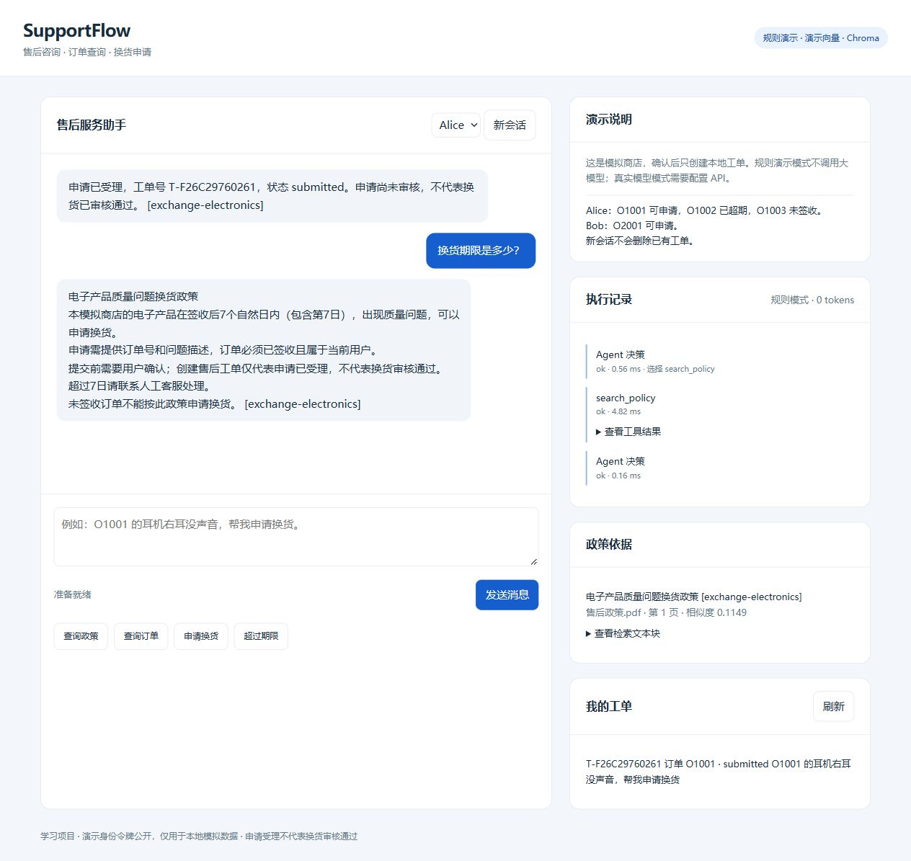
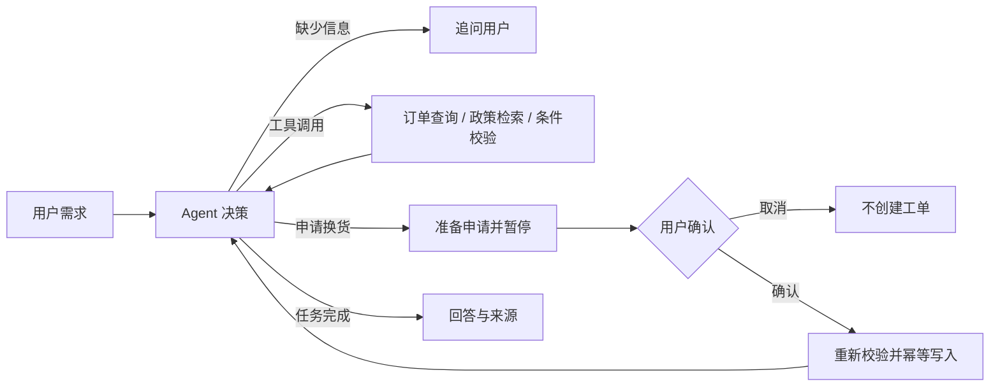

# SupportFlow

基于 Python、FastAPI、LangChain 组件和 LangGraph 的售后工单 Agent 教学项目。

用户提出质量问题换货需求后，系统补全订单信息、查询订单、检索政策、验证条件，
在用户明确确认后创建模拟工单。所有订单与政策均为虚构数据。

**默认规则演示模式无需 API Key。真实模型模式接入支持工具调用的兼容 API。**
规则模式用于学习和测试后端流程，不是大模型推理，不能将它的评测分数作为模型准确率。



## 快速运行（你已有的 Conda 环境）

在当前项目目录打开终端：

```powershell
conda activate langchain
python -m pip install -e ".[dev]"
python -m scripts.lesson1
python -m scripts.ingest
python -m scripts.lesson2
python -m scripts.demo
python -m uvicorn supportflow.api:app --host 127.0.0.1 --port 8000
```

访问 <http://127.0.0.1:8000>；接口文档为 <http://127.0.0.1:8000/docs>。

当前电脑若终端不能激活 Conda，可以直接使用已验证的解释器：

```powershell
& "C:\Users\wxw15\miniconda3\envs\langchain\python.exe" -m scripts.lesson1
& "C:\Users\wxw15\miniconda3\envs\langchain\python.exe" -m uvicorn supportflow.api:app --host 127.0.0.1 --port 8000
```

新电脑建议使用 Python 3.11 或 3.12。安装测试过的依赖版本：

```powershell
python -m pip install -r requirements.lock.txt
python -m pip install --no-deps -e .
```

无需 `.env` 即可使用规则模式。有需要时复制 `.env.example` 为 `.env`，只在本地填写配置。
如果 Windows 终端中文显示异常：`$env:PYTHONIOENCODING = "utf-8"`。

## 跟着代码一步步学

从 [搭建教程](docs/一步步搭建.md) 开始，每步都有代码位置、执行命令、预期结果和修改练习。
面试前阅读 [设计取舍与面试问题](docs/面试讲解.md)。

| 阅读顺序 | 文件 | 职责 |
| --- | --- | --- |
| 1 | `supportflow/business.py` | 订单、业务规则、工单、数据库唯一约束 |
| 2 | `supportflow/ingest.py` / `embeddings.py` / `retrieval.py` | PDF 读取、切分、向量化、Chroma 建库与检索 |
| 3 | `supportflow/tools.py` | 工具 schema 与服务端身份注入 |
| 4 | `supportflow/demo_model.py` | 用规则产生 AIMessage，观察工具调用协议 |
| 5 | `supportflow/graph.py` | 模型调用、工具循环、interrupt 与 checkpoint |
| 6 | `supportflow/service.py` | 会话所有权、恢复与审批重放 |
| 7 | `supportflow/api.py` | HTTP 接口与输入校验 |

## 一次任务的流程

知识库先单独建立：

```text
output/pdf/*.pdf
  -> PyPDFLoader：每页读取为 Document，保留文件名、页码
  -> RecursiveCharacterTextSplitter：切成带重叠的文本块
  -> Embeddings.embed_documents：把每个块转成向量
  -> Chroma：持久化文本、向量和元数据到 runtime/knowledge
```

提问时：`问题 -> embed_query -> Chroma 余弦检索 -> 文本块进入工具结果 -> 模型回答`。
`AGENT_MODE=demo` 使用规则展示检索文本；只有 `llm` 模式会调用大模型生成回答。
默认 `EMBEDDING_PROVIDER=demo` 使用哈希向量；切换 `api` 后才使用真实嵌入模型。
业务订单和工单仍在 SQLite 中，Chroma 负责知识库向量。

项目自带 `output/pdf/售后政策.pdf`。替换或新增 PDF 后，运行 `python -m scripts.ingest`。
内容与配置未变化时复用索引；发生变化时生成新快照，全部写入成功后才启用。
修改 `data/policies.json` 后，可运行 `python -m scripts.create_policy_pdf` 同步示例 PDF，
再运行 ingest。结构化规则用于业务校验，检索正文不能直接覆盖业务规则。
`CHUNK_SIZE=240`、`CHUNK_OVERLAP=40` 按字符数计量；短页可能只有一个块。
`RETRIEVAL_MIN_SCORE=0.10` 是演示阈值，真实向量模型需重新评测和校准。



工具结果作为 `ToolMessage` 回到模型，模型选择下一步；不是把三个固定函数调用包装成“推理”。
规则模式的路径是预设的；真实模式的工具选择由模型完成，审批和业务规则始终由后端控制。

## 演示数据

首次创建数据库时，签收日期相对于业务时区当天生成；后续启动不会重置日期。

| 演示用户 | 订单 | 初始状态 |
| --- | --- | --- |
| Alice | O1001 | 已签收 3 天，电子产品，可申请质量问题换货 |
| Alice | O1002 | 已签收 45 天，超过政策期限 |
| Alice | O1003 | 已发货，尚未签收 |
| Bob | O2001 | 已签收 2 天，可申请 |

网页支持切换演示身份。接口头：`X-Demo-Token: demo-alice` 或 `demo-bob`。
身份令牌是公开测试值，**不是生产身份认证**。仅在 localhost 使用本项目的模拟数据。

试试：

1. “换货期限是多少？”——政策检索与引用。
2. “帮我查询 O1001 的订单。”——只调用订单工具。
3. “我的耳机右耳没声音，帮我申请换货。”然后提供 “O1001”——追问、审批。
4. “O1002 的音箱坏了，帮我申请换货。”——拒绝超期申请。
5. 以 Alice 查询 O2001——后端拒绝跨用户查询。

一个订单在本演示中最多创建一个工单，不包含工单关闭、重新申请和库存流程。
新建会话不会删除工单。`scripts.demo` 与评测使用独立数据库，不污染网页数据。

## 接入真实模型

复制 `.env.example` 为 `.env`，填写：

```dotenv
AGENT_MODE=llm
LLM_API_KEY=你的本地密钥
LLM_BASE_URL=你的模型服务兼容API地址
LLM_MODEL=你账号可用且支持工具调用的模型名
RETRIEVAL_MODE=vector
EMBEDDING_PROVIDER=demo
```

需要模型支持 `bind_tools` 对应的 Function Calling 协议。`LLM_BASE_URL` 的 `/v1` 等路径以服务商文档为准。
不填写 base URL 时使用适配器的默认地址；使用其他服务商务必填写正确地址。
重启服务后网页标识应为“真实模型”。不会自动从模型模式降级成规则模式。

真实向量模型需要单独配置：

```dotenv
EMBEDDING_PROVIDER=api
EMBEDDING_API_KEY=你的本地向量服务密钥
EMBEDDING_BASE_URL=向量服务的OpenAI兼容API地址
EMBEDDING_MODEL=该服务实际提供的嵌入模型名
```

这里的 API 适配器要求 `/embeddings` 兼容接口；聊天服务和向量服务可以使用不同服务商。
不要直接将聊天模型名称填入 `EMBEDDING_MODEL`。配置之后先运行
`python -m scripts.ingest`，再重启服务；更换向量模型需要重新生成全部文档向量。

本地 Ollama 部署 `bge-m3` 后，可以这样配置：

```dotenv
EMBEDDING_PROVIDER=api
EMBEDDING_API_KEY=ollama
EMBEDDING_BASE_URL=http://localhost:11434/v1
EMBEDDING_MODEL=bge-m3
```

`api` 表示调用 HTTP 接口，本地模型同样适用。`ollama` 是兼容客户端使用的占位值。
先运行 `python -m scripts.test_embeddings`：检查批量与问题向量、少量语义样例、
PDF 建库及 Chroma 持久化检索，报告保存到独立的 `runtime/embedding-checks/`。
此命令不会修改 `.env` 或当前知识库；正式启用时将上述配置写入 `.env`，运行 ingest 并重启服务。
真实语义模型的相似度分布不同，默认演示阈值可能返回无关文本，需评测后调整，
不能仅凭相似度分数判断证据是否足够。

没有配置真实密钥时，真实服务调用和真实模型效果**尚未验证**。
离线协议测试只证明工具执行、审批、失败恢复等代码路径，不代替实际模型验收。

## 测试与评测

```powershell
python -m pytest
python -m ruff check .
python -m scripts.evaluate
# 配置密钥后主动运行，会消耗模型额度：
python -m scripts.evaluate --mode llm
```

`evals/cases.json` 有 24 个行为案例，覆盖政策、权限、追问、换货期限、确认、取消及重复审批。
评测使用独立数据库并保存 `evals/results.local.json`，检查状态、工具、来源、回答关键内容和工单数量。
报告包含通过率、未确认写入、耗时、服务商返回的 Token usage。
这是固定小样本回归，不是行业 benchmark；关键词断言不等于完整语义评估。

确定性案例中引用校验验证来源 id 与内容；真实模型可能误用引用，需人工审阅其回答。
真实模型评测完成后再把真实结果写进简历，不要使用规则模式的通过率冒充 LLM 效果。

## 可靠性设计

- user_id 来自服务端身份映射，不作为模型可填写的工具参数。
- SQL 查询绑定用户；参数通过占位符传入。
- `interrupt()` 暂停时不写工单；确认恢复后重新校验。
- 工单的申请编号和订单编号有唯一约束，重复点击或恢复不会重复写入。
- 记录审批决定，重复决定可重放；不同决定或过期审批被拒绝。
- SQLite checkpoint 保存对话与工具状态，进程重启后可以继续确认。
- 模型调用有超时与有限重试；工具错误结构化返回；Agent 有最大步数。
- 单进程内同会话串行执行。同步 HTTP 路由在线程池运行，不阻塞事件循环。
- 页面用 textContent 渲染用户/模型文本，不把输出当成 HTML 执行。

运行数据包含模拟对话与工具结果，只保存本地并被 `.gitignore` 排除。

## 当前边界

- 教学和作品集项目，没有真实商家、真实退款或支付。
- 只支持一个服务进程，不要加 `--workers 2`；SQLite 与内存会话锁不等于分布式方案。
- 无生产登录、限流、租户体系、日志脱敏平台、持久任务队列或负载测试。
- 当前只有三页虚构政策 PDF；支持文本提取与切分，扫描版需要先 OCR。没有重排序模型。
- 默认 Embedding 是确定性哈希编码器，不是预训练语义模型；它只用于验证向量数据流程。
- 对话与事件不断追加，尚未做上下文压缩和会话生命周期回收。
- 返回完整单轮响应，没有逐 Token 流式输出；执行记录记录已完成节点，失败节点不一定有事件。
- 提示词提醒模型忽略文档指令，不代表已解决提示注入；硬性权限与写入审批在后端执行。
- 真实模型可能选错工具或输出无依据内容，需用实际评测继续优化。

## GitHub 准备

确认 `.env`、`runtime/` 不在上传内容中，运行测试，补一段真实演示录像。
项目文件已经可用于建立仓库；当前没有替你创建远程仓库或推送。

建议简介：`Python support agent with LangGraph, RAG, human approval and regression evaluation`。
MIT License 适用于本仓库代码；政策和订单为随项目提供的虚构示例。

## 官方参考

- [LangGraph overview](https://docs.langchain.com/oss/python/langgraph/overview)
- [LangGraph interrupts](https://docs.langchain.com/oss/python/langgraph/interrupts)
- [LangGraph persistence](https://docs.langchain.com/oss/python/langgraph/persistence)
- [LangChain models and tool calling](https://docs.langchain.com/oss/python/langchain/models)
